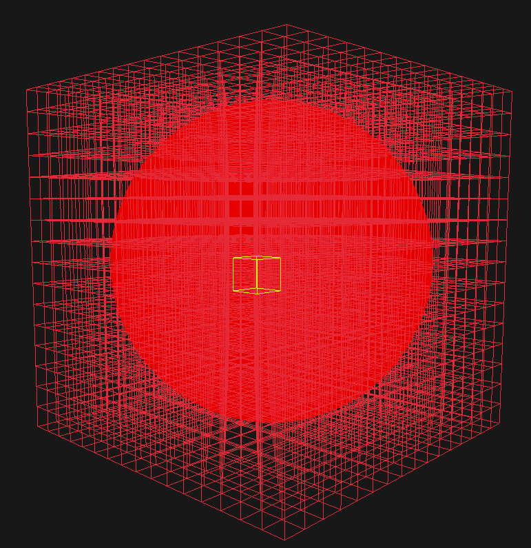

# Marching cubes in C with Raylib

<div style="text-align:center">

</div>

Simple Marching Cubes algorithm implimentation using C and [Raylib](https://www.raylib.com/) for rendering. 
Inspired by tutorials: 
* https://paulbourke.net/geometry/polygonise/
* https://polycoding.net/marching-cubes/part-1/

[](LICENSE)


## Build

### Requirments
* C/C++ compiler (MSVC 2015, gcc, clang, etc...)

### Visual Studio 2022 build

```console
$ init.bat
$ build.bat
$ .\build\mcubes.exe
```